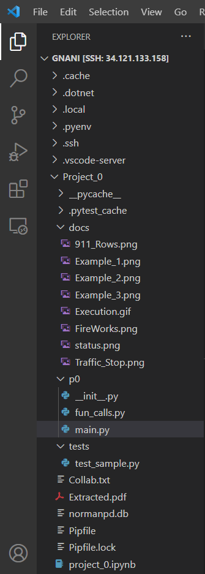
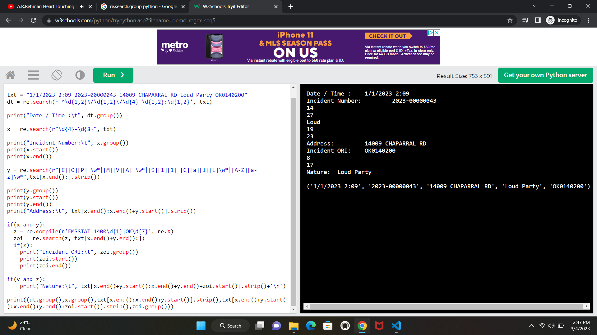
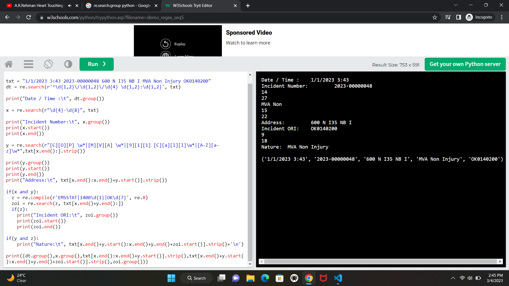
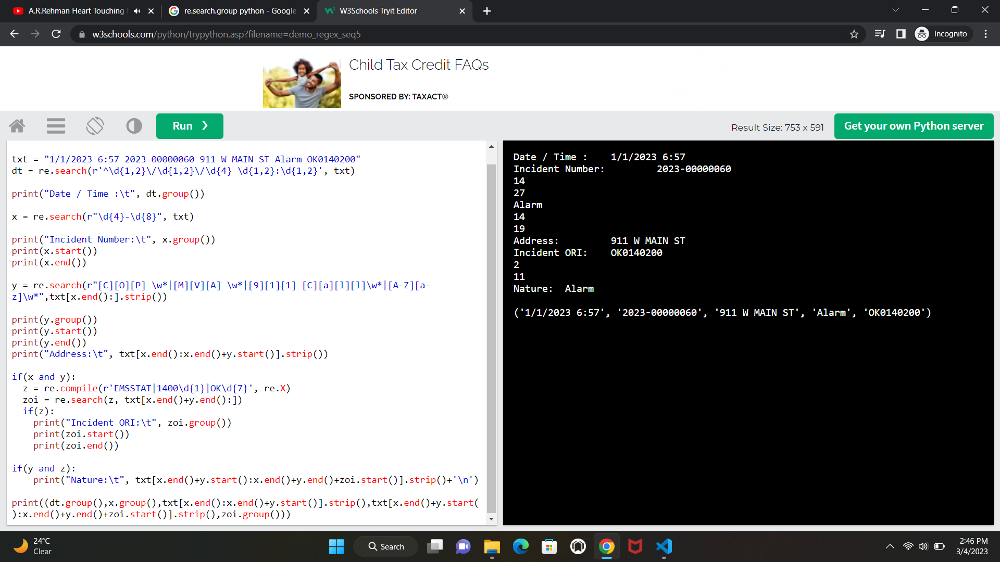
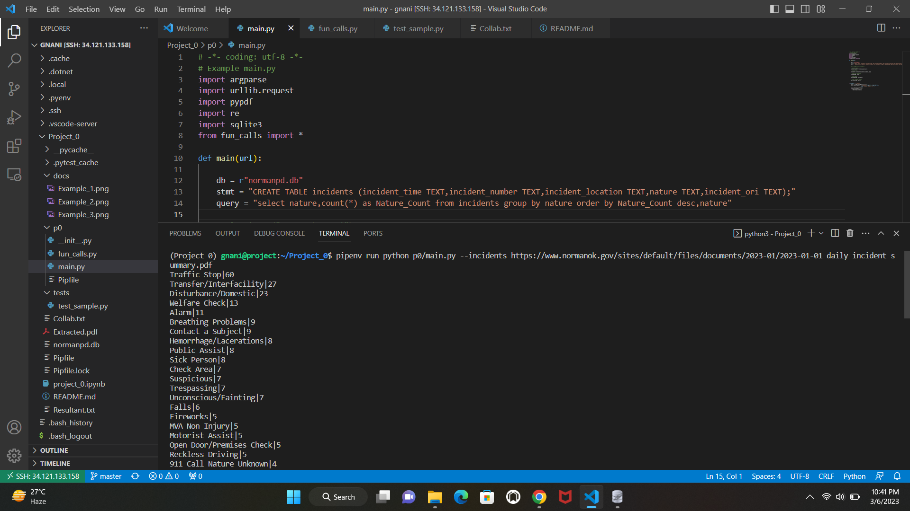
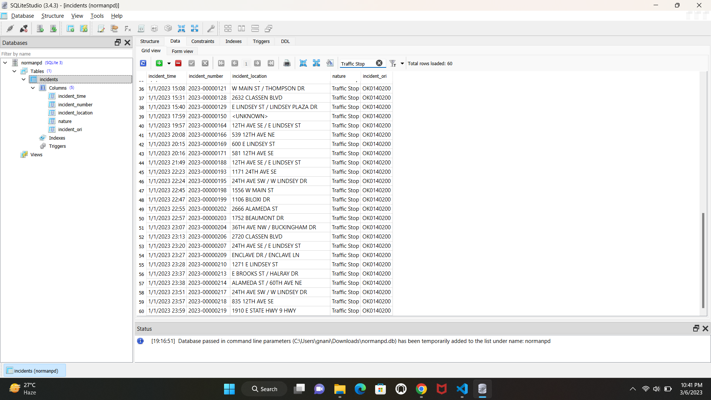
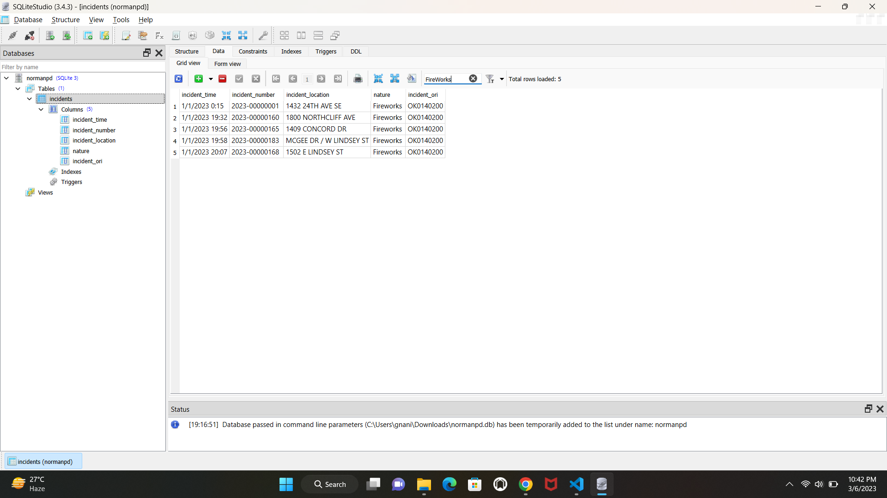
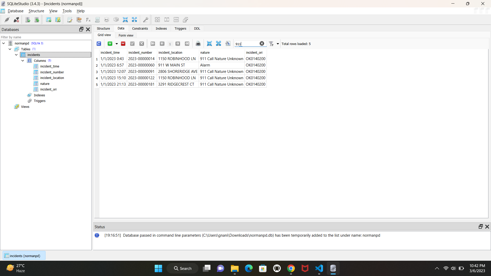
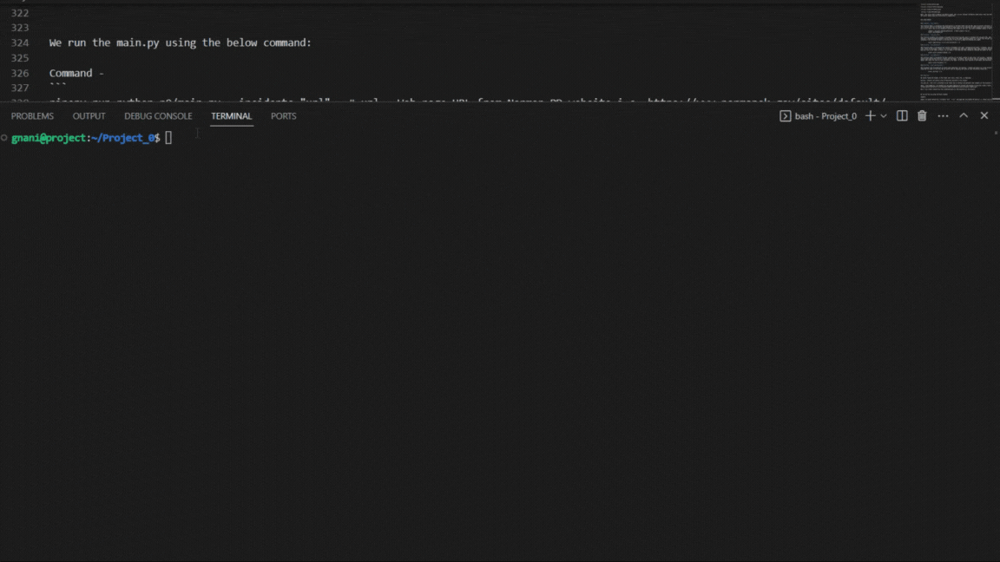

In this project, we extract the Incidents summary data from Norman Police Department website and store it in sqlite database. Please find the summary of project as follows:

#### Steps followed:

1. Downloaded the data using urllib.request by passing respective URL as input to a function
2. As downloaded data is in 'bytes' format, we have written the content to a local pdf file
3. Read the content from local pdf file using pypdf module
4. saved content of each page as item of a list
5. Traversed through each line of the content and saved each row as an item of list
6. Used regular expressions to extract the matching key words of the header fields
7. Identified lines which have excess content written on the following line i.e., address
8. Appended the excess content to its actual row and updated identified row with empty string 
9. Used regular expression to extract the "Date / Time" and saved values to a list
10. Similarly, used regular expression to extract the "Incident Number","Address","Ori","Nature" and saved values to a list
11. Identified the start and end of "Address" and "Nature" using regex and string indices
12. Created a list of (resltant fields) which helps to perform the insert operation in sqlite db
13. Created a db named as normanpd.db and performed table creation ("incidents")
14. Upon iterating over the resultant list (group of fields), insert command has been executed and committed the operations at the end
15. To execute the given status operation, sql query has been formatted and fetched all the rows upon its execution. While printing, the rows are formatted as per the instruction

Now, we go through further explanation on functions used and their explanation.

##### File Structure Snap



#### Function - "fetchincidents(url)"

It takes URL as input and returns the content of the web page considering each line as an item of list.
We have mentioned headers to specify browsers which can execute the crawling script. 
```
urllib.request.urlopen(urllib.request.Request(url, headers=headers)).read()  # It helps in Sending a request to URL and obtain content from it
```
As this retruns the data in the form of 'bytes', we have created a local pdf file named "Extracted.pdf" and written the web page content in "wb" mode. Further, we opened the same file in 'rb' mode and used pdfReader() to extract the content from the pdf file which retruns text in string format. Using "reader.pages", we traversed through all pages of the pdf document and collected content using "extract_text()", saved each page as list item. Generated a text file using the list of pages (This is to write content of all pages of pdf in a single text file so that it helps to identify each line and process further). Using readlines(), each line has been captured and saved as list item.

Thus, this function retruns a list of lines from the extracted content.


#### Function - "extractincidents(collect)"

It takes list of content lines as input and returns the tuple of 5 fields ("Date / Time","Incident Number","Address","Nature","Ori") as each element of list. We knew that the first row of the content is the group of header fields. So, consider :
```
        print(collect[0])

        re.search(r'D\w*e \/ T\w*e',collect[0]).group()  # Regex identifies the value - "Date / Time" in the first row of content.
```
search() - helps in finding the first matching pattern in the string passed to it. group() retruns only one value as there are no sub groups with matching words. Similarly, used regex patterns to print and validate the search() usage.


Note : considering the content of the pdf, 2 rows are excluded from processing. 
**Row - 1** : It contains only header fields 
**Row - Last** : It contains the value - updated date and time of the Web page

So, we iterate over the list - "*range(1, len(collect)-1)*"

Firstly, we consider the Date / Time field. We used the regex :   *re.search(r'^\d{1,2}\/\d{1,2}\/\d{4} \d{1,2}:\d{1,2}'*, collect[i]). It captures the matching sequences i.e., 1/1/2023 6:56. We appended these values to a list - date_time

> **Issue - 1**: Some strings are exceeding the content on their lines and available in following lines. i.e, 

1/1/2023 0:20 2023-00000004TECHNOLOGY PL / E STATE HWY 9 
HWYTraffic Stop OK0140200

###### Resolution - 1: 

Regex identifies only the sequences which starts each line with given sequence. As these lines with excess conten will not start with the pattern, these will be disregarded while appending to the date_time. Using else condition, these lines with excess information has been captured.
```
                    if(dt):                                                 # If pattern match with "Date / Time", saving to a list
                        date_time.append(dt.group())
                    else:                                                   # Else, Index capture of rows with extra content
                        stop_lines.append(i)
```
Here, stop_lines() contains the indices of rows with excess content which helps in appending this info to the previous line. Also, these rows are updated with empty strings to avoid further issues while using regex for ORI and Nature fields.
```
                    for i in stop_lines:
                        _ = collect[i].strip()
                        collect[i-1] = collect[i-1].strip() + _                # Appending the lines with excess content to it's previous line
                        collect[i] = ''
```
##### Example - 
After processing as above, 
```
    1/1/2023 0:20 2023-00000004TECHNOLOGY PL / E STATE HWY 9HWYTraffic Stop OK0140200    # Single Line
```
To avoid confusion, we are processing rows which only have content (Excluding rows with more info which are updated with empty string) 
```                    
                    if(collect[i]!=''):
```                        

Secondly, we consider the Incident Number field. We used the regex :   re.search(r"\d{4}-\d{8}", collect[i]). It captures the matching sequences i.e., 2023-00000004. We appended these values to a list - incident_number

Then, we consider the Address field. We knew that address field is in between Incident Number and Nature fields and also we can see that it may start with Digits, Contains all Upper Case Letters for which we may use the regex matching [\d] & [\w]. But due to variable length of the address field and possibility of multiple white space characters makes it tough to format a matching pattern. So, I would like to use the Indices of fields before and after the address and use them to capture the value. Please find the below process:
```
        [Date / Time]+[Incident_Number]+{...Address...}+{...Nature...}+[ORI]
```
> **Issue - 2**:  Differentiating nature fields from the address due to case sensitivity.
```
        "1/1/2023 3:43 2023-00000048 600 N I35 NB I MVA Non Injury OK0140200"      # Nature - MVA Non Injury
```
###### Resolution - 2: 

We can see that Nature field values - Either start with specific upper case letters ([COP],[MVA],[911]) or Usually start with a Uppercase letter following multiple lowercase characters and digits ([A-Z][a-z]\w*).So consider the below pattern for Nature:
```
        y = re.search(r"[C][O][P] \w*|[M][V][A] \w*|[9][1][1] [C][a][l][l]\w*|[A-Z][a-z]\w*",collect[i][x.end():].strip())

        Here, we search the string from the next character of the [Incident_Number] to make the processing better. We make use of start() & end() from the output of search result.

        x = re.search(r"\d{4}-\d{8}", collect[i]).start() # Retruns the index of character from which the pattern matches

        x = re.search(r"\d{4}-\d{8}", collect[i]).end() # Retruns the index of last char which matched the pattern

        Thus, Address =>   text([(last char index of Incident_Number + 1):(Till Start index of Nature)])


        if(y):
            address.append(collect[i][x.end():x.end()+y.start()].strip())
        elif(re.findall(r'^\d{1,2}\/\d{1,2}\/\d{4} \d{1,2}:\d{1,2}', collect[i])):
            address.append('NA')
```


> **Issue - 3**:    Regular Expression update considering address values
```
        "1/1/2023 6:57 2023-00000060 911 W MAIN ST Alarm OK0140200"     # 911 in both Nature & Address fields
```
###### Resolution - 3: 

This has been tricky while dealing with regex pattern considering Nature - "911 Call Nature Unknown". If we just use the regex ([9][1][1]\w*), above row fails to meet the requirement as the number 911 is being captured from the Address (911 W MAIN ST) but not from the Nature. So, I modified the regex by considering ([9][1][1] [C][a][l][l]\w*)


> **Issue - 4**:  Missing Address and Nature fields
```
         "1/1/2023 20:17 2023-00000172 OK0140200"
```
###### Resolution - 4: 

Here, we didn't have the Address and Nature fields in the pdf file. But we need to capture these fields values and mention them as 'NA' so that we can specify the entries to databse. This can be made possible with the else statement (address.append('NA') - If theres no string between mentioned indices, list appends a value of 'NA'.)


In next step, we consider the field - Incident ORI. We used the regex :   r'EMSSTAT|1400\d{1}|OK\d{7}'. It captures the matching sequences i.e., {OK0140200 or EMSSTAT or 1400{\d}}. We appended these values to a list - ori.
```
            if(x and y):
                z = re.compile(r'EMSSTAT|1400\d{1}|OK\d{7}', re.X)
                zoi = re.search(z, collect[i][x.end()+y.end():])

            if(z):
                ori.append(zoi.group())
```
> **Issue - 5**:  Regex update on ORI considering Address values
```
        "1/1/2023 2:09 2023-00000043 14009 CHAPARRAL RD Loud Party OK0140200"       # 14009 also matches with ORI value
```
###### Resolution - 5: 

Here, we could see the that 1400\d{1} is the pattern that should match the Incident ORI value in the string. But, we have come across 14009 in the the address field value which alters the indices and returned ORI as 14009  i.e.,   ('1/1/2023 2:09', '2023-00000043', '14009 CHAPARRAL RD', '', '14009')

So, I considered to search the pattern (r'EMSSTAT|1400\d{1}|OK\d{7}') starting from the next index of the Nature field so that address will not be considered while retruning the matching sequence. This (collect[i][x.end()+y.end():]) helped in processing as required which retruns :  
```   
    ('1/1/2023 2:09', '2023-00000043', '14009 CHAPARRAL RD', 'Loud Party', 'OK0140200')
```

Finally, we consider the field - Nature. As this field is of variable length, I used indices to extract the values from the content. We knew that Nature field is in between Address and ORI so considered the index of last character in Address and starting character of the ORI field value. The text between these indices gives the Nature field value. This is described as below:
```
            if(y and z):                 
                nature.append(collect[i][x.end()+y.start():x.end()+y.end()+zoi.start()].strip())
            elif(re.findall(r'^\d{1,2}\/\d{1,2}\/\d{4} \d{1,2}:\d{1,2}', collect[i])):
                nature.append('NA')
```
##### Snapshots: 







##### Assumptions:

Strip() has been used to remove any trailing white spaces after processing the field values.

***"NA"*** has been considered in place of missing address and nature fields and inserted in table.

The result values are appended to the list - nature. 

Now, we have retrieved values of all fields in the content. To use them for db insertion, we nedd them in the form of a tuple(). i.e,
```
            ('1/1/2023 2:09', '2023-00000043', '14009 CHAPARRAL RD', 'Loud Party', 'OK0140200')

            So, a list - incidents has been created and the tuples of these 5 field values are appended to it.

            incidents = []
            for i in range(row_count):
                incidents.append((date_time[i], incident_number[i], address[i], nature[i], ori[i]))

            """ for i in range(len(incidents)):
                print(incidents[i]) """
```
Thus, this function retruns a list containing tuples of 5 fields - incidents.


#### Function - createdb(db, stmt)

It takes database name and table creation statement as input and creates a database connection to a SQLite database & create a table using the query - "stmt".
```
            try:
                conn = sqlite3.connect(db_file)
                cursor = conn.cursor()
                cursor.execute(stmt)
                cursor.close()
            except Error as e:
                print("Error Occured", e)
            finally:
                if conn:
                    conn.close()
```
connect() helps in connecting to specified db. Using the connection variable, a cursor is created which helps in executing the table creation query.
```
            db = r"normanpd.db"
            stmt = "CREATE TABLE incidents (incident_time TEXT,incident_number TEXT,incident_location TEXT,nature TEXT,incident_ori TEXT);"
```
We used exception handling mechanism to catch troubles while connecting to db and any execution of queries. Here, Error class retruns the respective details if we come across any issue. Moreover, we close the connection after execution of the query.

This creates "normanpd.db" in the same file path as that of execution and creates a table - incidents.


#### Function - populatedb(db, incidents)

It takes database name and list of field's values as input and prints the last row id of the table - incidents in sqlite database.
```
            sql = ''' INSERT INTO incidents(incident_time,incident_number,incident_location,nature,incident_ori) VALUES(?,?,?,?,?) '''

            for i in range(len(incidents)):
                cursor.execute(sql, incidents[i])
                conn.commit()
            cursor.close()

            print(cursor.lastrowid)
```
Here, we iterate over the incidents list so that cursor.execute() performs an insertion of each list item to the table. We commit() the operation and close the cursor() once all rows have been inserted. This function prints the last row id of the table which helps us to understand the number of rows inserted to the table.


#### Function - Sel_status(db, query)

It takes database name and select query as input and prints the result set of the given query as output to the console.

From given, We need the function that prints to standard out, a list of the nature of incidents and the number of times they have occurred. The list should be sorted first by the total number of incidents and secondarily, alphabetically by the nature. Each field of the row should be separated by the pipe character (|).

query = "select nature,count(*) as Nature_Count from incidents group by nature order by Nature_Count desc,nature"

It groups the nature field considering the occurrences of nature in the content of the pdf file and sort the result based on count and then by nature.
```
            try:
                conn = sqlite3.connect(db_file)
                cursor = conn.cursor()
                cursor.execute(query)
                rows = cursor.fetchall()
                for r in rows:
                    print(r[0]+'|'+str(r[1]))
                cursor.close()
```
cursor.execute() helps in executing the select query and fetchall() retruns the resultant rows in the form of tuples. As per requirement, we need to join them by a pipe symbol which can be done using the statement (r[0]+'|'+str(r[1])). Thus, it prints the result in descending order of the count and then by considering nature alphabetically. 

##### Status snapshots:

Once the status result has been retruned to the console, the count of nature field values have been verified by connecting to the normanpd.db database through sqlite studio. Upon filtering a specific nature field, the count can be observed on the sqlite studio console.









Note : 911 occurs both in Address and Nature fields. But, we only consider the Nature field value ("911 Call Nature Unknown") count. Here, the sqlite studio shows all occurrences of keyword 911.


Test Case Checks:
---------------

#### Function - test_fetch()

This function helps in validating the functionality of the data fetch from the URL. Upon successful retrieval, the function - fetchincidents(url) retruns the list of content items whereas an empty list will be returned if there exists an issue with the URL or processing the given url if it's valid. This can be checked by verifying the length of the list. The assert statement checks if the list is empty or not.
```
            content = fun_calls.fetchincidents(url)  # Fetch content from url
            assert len(content)!=0
```
#### Function - test_extract()

This function validates the working of incidents extraction from data which is fetched from the given URL. Upon successful retrieval, function - extractincidents(content) retruns the list of pdf data containing tuples of 5 fields from the pdf. In this function, we are checking if the retruned variable is list and also if the list is empty by checking the length.
```
            assert type(collect) is list and len(collect) != 0
```
#### Function - test_dbcreate()

This function helps in validating the creation of database with name - normanpd.db and table - incidents. The function - createdb(db_file, stmt) creats db and drops a table if it exists and creates new table with specified name. Upon successful db and table creation, we will not have any rows in the table initially. So, we check if the table has been created by checking the number of rows in it is equal to 0.
```
            assert cursor.fetchall()[0][0] == 0
```
#### Function - test_dbinsert()

This function helps in validating the data insertion to the table created in above step. The function - populatedb(db_file, incidents) inserts each item of the list as a record into the table - incidents. We can verify this by checking the lastrowid returned by the cursor object that shows the count of rows inserted to the table. If no rows were inserted in the table, the lastrowid returns 0.
```
            assert cursor.lastrowid != 0
```
#### Function - test_resultstatus()

This validates the functionality of select query specified. The function - fetches the result set using fetchall() which contains the Nature field and its count in the file. We can verify this by checking the count of rows retruned by result set.
```
            assert len(rows) != 0
```

### Execution:

We create respective folders in the folder path (docs, tests, etc. as required).

main.py - contains the overall view of functions involved in this project.

fun_calls.py - This file is available in p0 folder and it contains the detailed code snippets for the function specified in main.py

tests : test_sample.py - It contains all the tests required to validate the working of functions using a static variable - URL (https://www.normanok.gov/sites/default/files/documents/2023-02/2023-02-27_daily_incident_summary.pdf). 

docs - This folder contains all the screenshots/gifs to show execution of the project.


We run the main.py using the below command:

Command - 
```
pipenv run python p0/main.py --incidents "url"   # url - Web page URL from Norman PD website i.e, https://www.normanok.gov/sites/default/files/documents/2023-01/2023-01-01_daily_incident_summary.pdf
```

Output - It returns the Nature field values and their count separated by '|'

Test Check - 

```
pipenv run python -m pytest
```

Output - It returns the status of test checks based on assert conditions mentioned in the test_sample.py file

Execution Sample Gif:

